# Report

This report will discuss several topics while dealing with the analysis of specific problems that can be modelled using ODEs and solving them numerically with different methods.
Such methods are usually obtained by integrating the ODE and using numerical integration on the given function $f(t,y(t))$.

In the first example, we are given the mass-spring relation, which is given by the following equation:
$m y''(t) = -k y(t)$
, where $m$ is the mass and k the spring constant. This is an ODE of second order, so first we need to rewrite it  as a problem of first order:

$$
\begin{aligned}
y_0' &= y_1, \\
y_1' &= -\frac{k}{m} y_0 .
\end{aligned}
$$

Now we have a 2-dimensional system that can be written as $y'(t) = f(t,y(t))$ or, in that specific case, it is an autonomous system, so $f = f(y(t))$ only.
Before looking into the numerical schemes, we should analyse what solution we should expect from this problem. If we look at the system, it becomes clear that it is a Hamiltonian system, and therefore, we expect a solution that is conservative with respect to time. Also, if we study the system as a matrix system, we get imaginary eigenvalues with real part = 0. This indicates that the solution of the system must be closed circles in a phase plot.

In the following, we will investigate 4 different methods:
Explicit Euler, Explicit Midpoint Rule (Runge Kutta 2), Implicit Euler, and Crank-Nicolson Method.
Each of them was presented in the lecture.
For the implicit methods, we need to use Newton's method in order to solve for the next time step, since it involves solving an implicit equation.
This method has also been presented in class and is basically calculating the 0 of a given function by using Taylor expansion.
For the explicit Euler, we expect trajectories spiraling outwards, since it is not a symplectic integrator and the energy increases, s.t $E_{n+1} \ge E_n$.
For smaller time steps, this effect will be expected to be less strong.

For the implicit Euler, we expect the opposite effect, trajectories spiraling inwards. This is due to the fact that it is also not a symplectic integrator and it adds artificial damping to the system s.t $E_{n+1} \le E_n$.

For the explicit midpoint scheme, we expect better rates of convergence because it is a second-order method, compared to the other Euler methods. For the Crank-Nicolson scheme, we expect good results, because it can match the behavior of linear Hamiltonians very accurate, therefore, we expect almost perfectly closed circles even for smaller time steps. 
The simulation goes from $t_0=0$ until $t_{end}=4 \pi$

Explicit Euler 20 time steps
```{image} pictures/time_evolution_20.png
:width: 45%
```
```{image} pictures/phase_plot_20.png
:width: 45%
```

Implicit Euler 20 time steps
```{image} pictures/time_evolution_20_IE.png
:width: 45%
```
```{image} pictures/phase_plot_20_IE.png
:width: 45%
```

Improved Euler 20 time steps
```{image} pictures/time_evolution_20_RK2.png
:width: 45%
```
```{image} pictures/phase_plot_20_RK2.png
:width: 45%
```

Crank-Nicolson 20 time steps
```{image} pictures/time_evolution_20_CN.png
:width: 45%
```
```{image} pictures/phase_plot_20_CN.png
:width: 45%
```

Explicit Euler 100 time steps
```{image} pictures/time_evolution_100.png
:width: 45%
```
```{image} pictures/phase_plot_100.png
:width: 45%
```

Implicit Euler 100 time steps
```{image} pictures/time_evolution_100_IE.png
:width: 45%
```
```{image} pictures/phase_plot_100_IE.png
:width: 45%
```

Improved Euler 100 time steps
```{image} pictures/time_evolution_100_RK2.png
:width: 45%
```
```{image} pictures/phase_plot_100_RK2.png
:width: 45%
```

Crank-Nicolson 100 time steps
```{image} pictures/time_evolution_100_CN.png
:width: 45%
```
```{image} pictures/phase_plot_100_CN.png
:width: 45%
```

Explicit Euler 1000 time steps
```{image} pictures/time_evolution_1000.png
:width: 45%
```
```{image} pictures/phase_plot_1000.png
:width: 45%
```

Implicit Euler 1000 time steps
```{image} pictures/time_evolution_1000_IE.png
:width: 45%
```
```{image} pictures/phase_plot_1000_IE.png
:width: 45%
```

The results confirm the expectations. For large time steps, the implicit and explicit Euler are either exploding (Explicit) or totally decaying (Implicit). For the improved Euler, we see a slight increase of the energy for larger time steps but as soon as the time steps decrease enough, the solution becomes quite accurate, and we observe a closed circle.
For the Crank-Nicholson method, we observe already for very large time steps that the energy stays conserved, no increasing of amplitude or spiraling outwards in the phase plot. This is expected since it can represent the energy conservation pretty accurate for linear Hamiltonians.
For the Explicit and Implicit Euler, we see even for very small time steps, that the drift away from the equilibrium stays visible.


Electric Network:

In the next task, we want to model an electric network with an ODE. We are given a Voltage source $U_0 = cos(100 \pi t)$. We are given the variables $R$ for the resistance and $C$ for the capacity. 
The system can be written as :
$$
\begin{aligned}
U_c(t) + R C \frac{dU_c(t)}{dt} = U_0(t) \\
\frac{dU_c(t)}{dt} = -\frac{U_c(t)}{RC} + \frac{U_0(t)}{RC}
\end{aligned}
$$

So we can see our system is decomposed into a decaying exponential solution and oscillatory solution. 
The decay of the exponential solution is hereby determined by the term $\frac{-1}{RC}$. If $RC$ becomes small the transient behaviour vanishes very quickly.
We can solve the system and compute exact solution by splitting into homogeneous and particular solution and define $\tau = RC$ and $\omega = 100 pi$.

$$
\begin{equation}
U_C(t)
=
- \frac{1}{1+(\tau\omega)^2}
e^{-t/\tau}
+
\frac{1}{1+(\tau\omega)^2}\cos(\omega t)
+
\frac{\tau\omega}{1+(\tau\omega)^2}\sin(\omega t)
\end{equation}
$$

In the first test case, we set $R=C=1$. Therefore we expect visible decay of the amplitude of the oscillations and we expect similar results for all methods, where explicit might overshoot and implicit might undershoot amplitudes.
Since our stationary frequency is given by $f = 100 \pi / 2 pi = 50 Hz$, our period $T = 0.02s$, our time step should be small enough to detect oscillatory behavior. We run the simulation from $t_0 = 0$ to $t_{end} = 5s$.
So we expect for $N \geq t_{total}/\Delta t = 5/0.02 = 250$, that we see some oscillatory behavior.
And in general we expect to see mostly a sinusoidal function since the prefactor of the exponential and the cosinus are two orders lower then the prefactor of the sine term.

5000 time steps
<p align="center">
  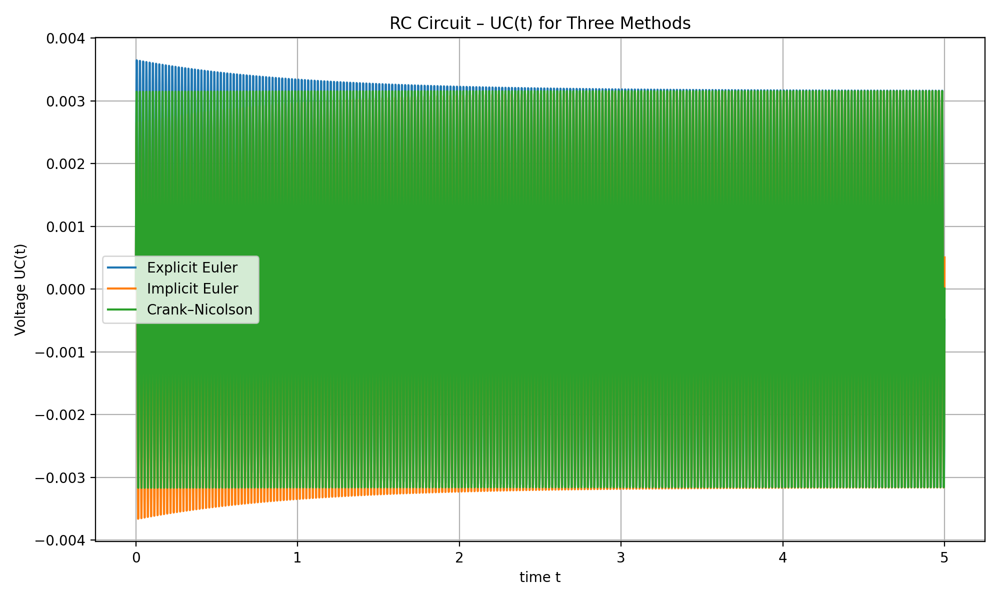
  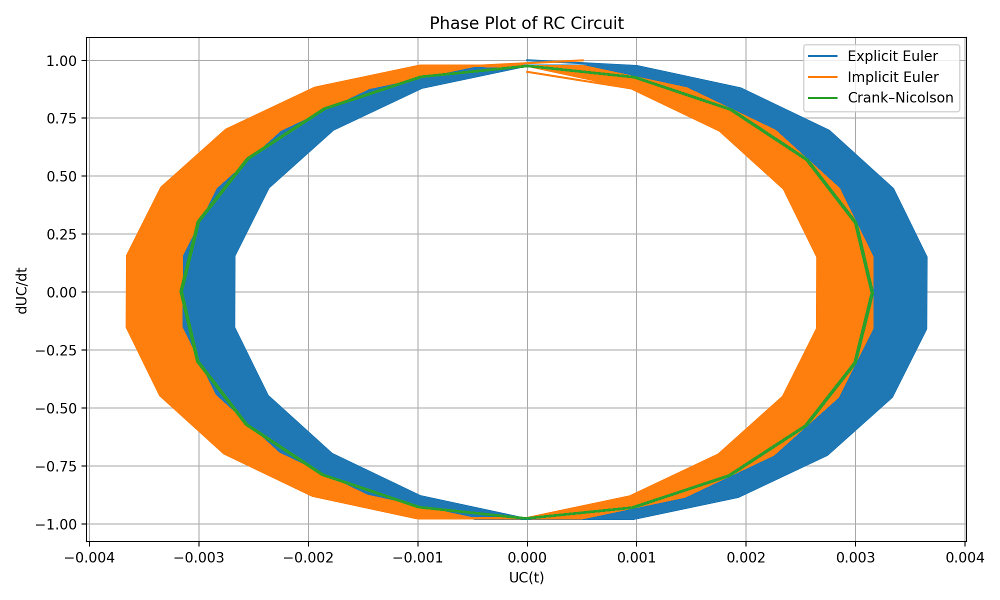
</p>

1000 time steps
<p align="center">
  
  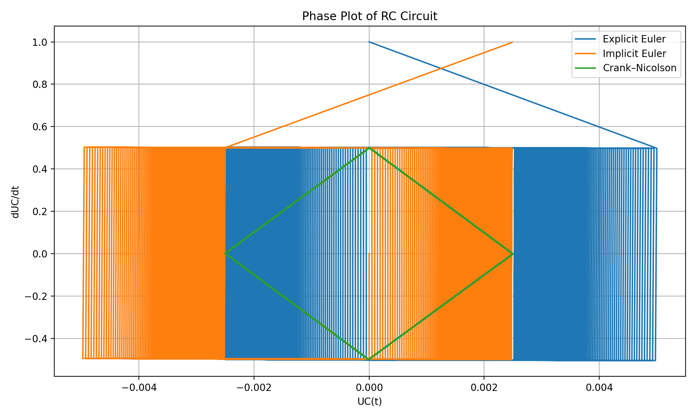
</p>

200 time steps
<p align="center">
  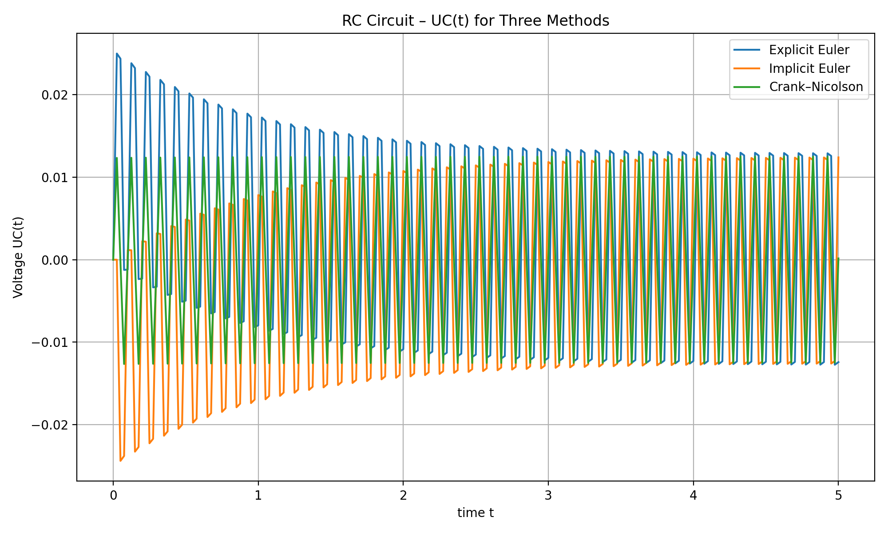
  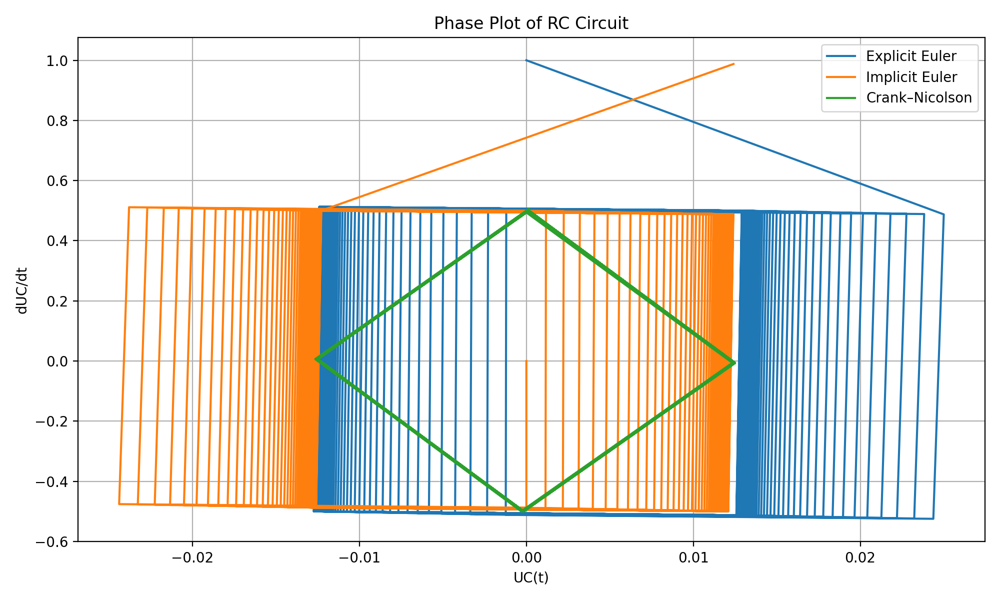
</p>

50 time steps 
<p align="center">
  
  
</p>

By analyzing the results, it becomes clear that the explicit Euler is underdamping, gives higher values first and then slowly decays to the stationary oscillating solution. The implicit Euler will give lower values and also decay to the stationary oscillating solution. As for the Crank Nicolson, we don't see numerical damping so we only see the stationary solution which is oscillating.
For larger time steps, for example $N=200$, we already see that the amplitudes are increasing and we don't fully recover the oscillations, which completely die out when we only use $N=50$.
So for small time steps, the Crank Nicholson recovers the behavior of the true solution the most, and our time steps should in general be small enough s.t we can recover the oscillations.

Next we look into the second case, where $RC = 10^{-4}$, therefore the homogeneus solution is now modelled by a "stiff ODE", because its transient response is vanishing really quick. This has some implications on the different methods. In general, the Explicit Euler should not be used for such models due to the nature of its stability function. For such high eigenvalues, we need really small time steps to be in a stable regime. In that case, we should expect exploding solutions for the Explicit Euler for $N \leq 10^4/2$. For the other two methods, they should remain always stable, since $\lambda \leq 0$. This time, we only simulate for $1s$. and the solution should be dominated by the cosine term this time, with the explonential decaying "quasi immediately".


5000 time steps
<p align="center">
  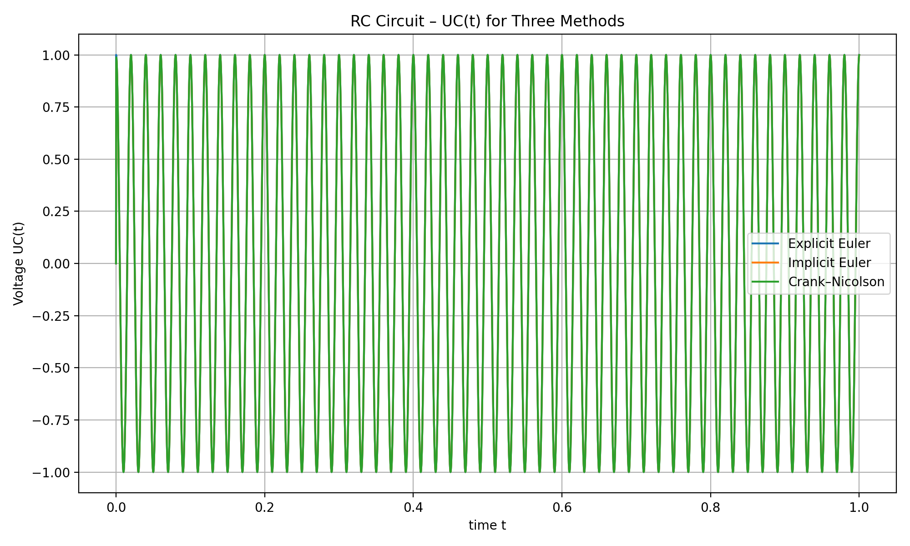
  
</p>

1000 time steps with Explicit Euler
<p align="center">
  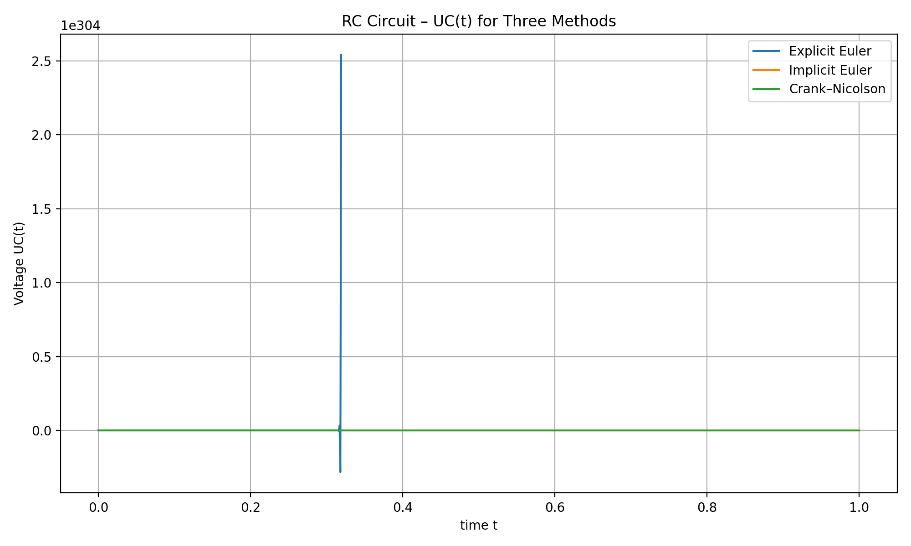
  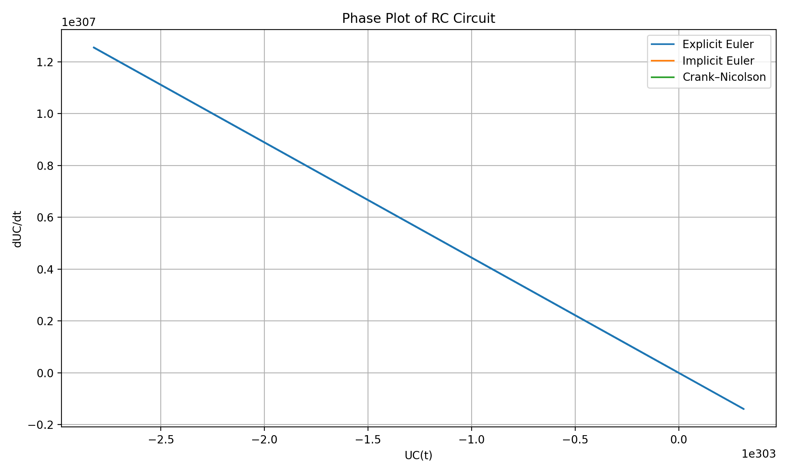
</p>

1000 time steps without Explicit Euler
<p align="center">
  
  
</p>

200 time steps
<p align="center">
  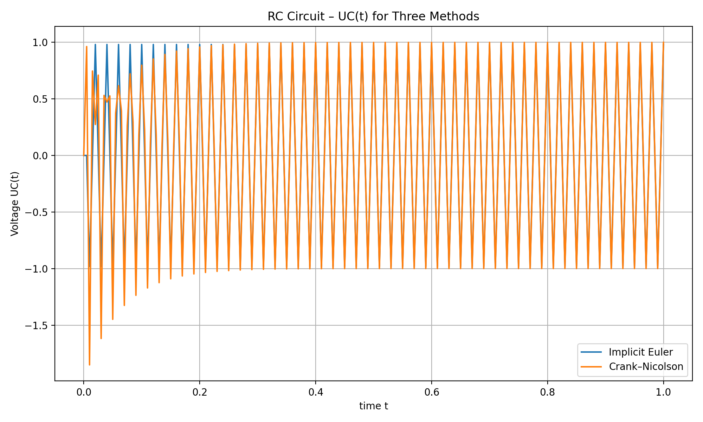
  
</p>

110 time steps 
<p align="center">
  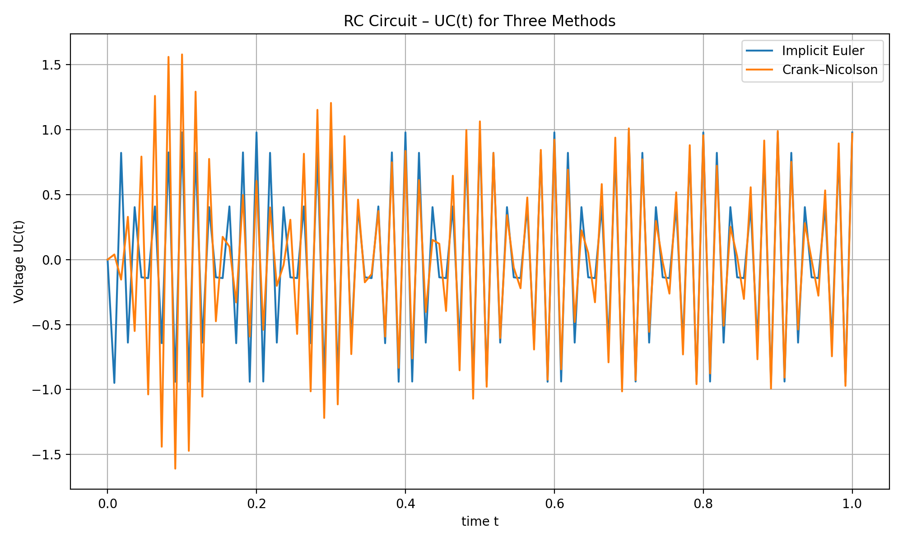
  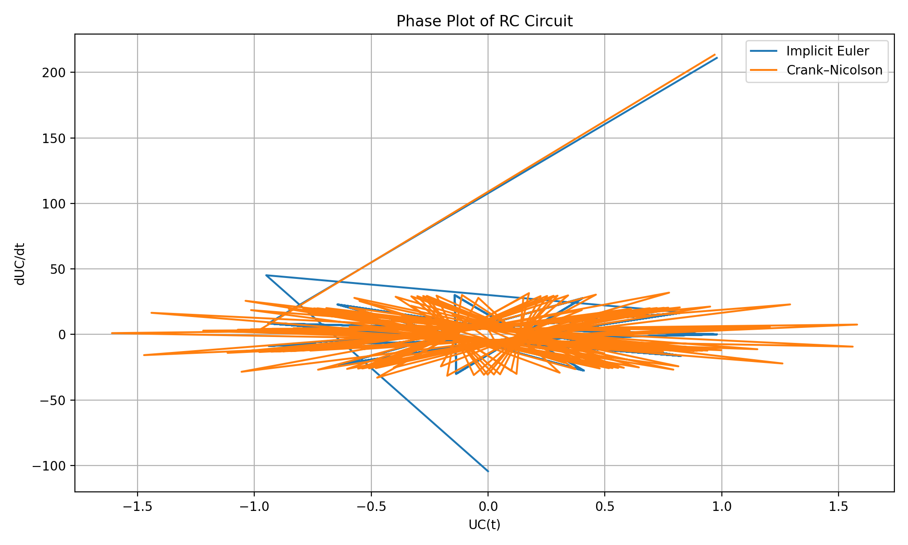
</p>

So we see how for still small time steps like $\delta t = 0.001$, the Explicit Euler is already exploding and therefore should not be used for such problems.
As for the other methods they show good behavior and for larger time steps we see some unnatural oscillations in the beginning for the Crank Nicholson method, while the implicit Euler gives more accurate results since it is A and L stable. 
Again for larger time steps, the oscillations are not fully resolved and we loose accuracy.

