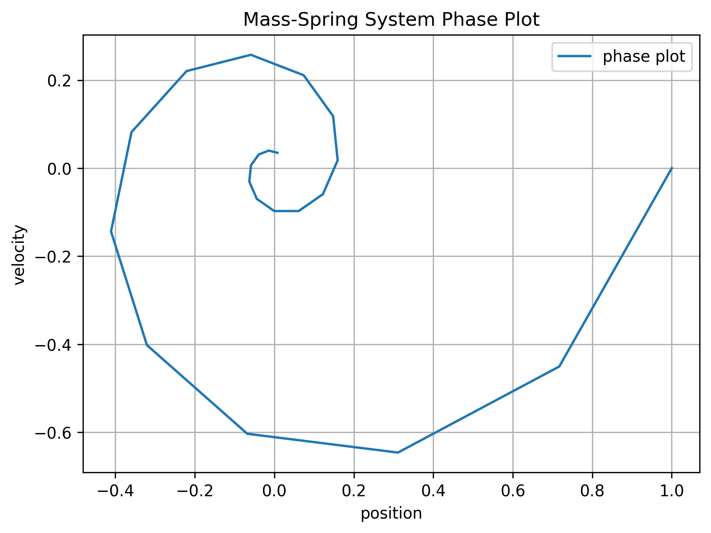
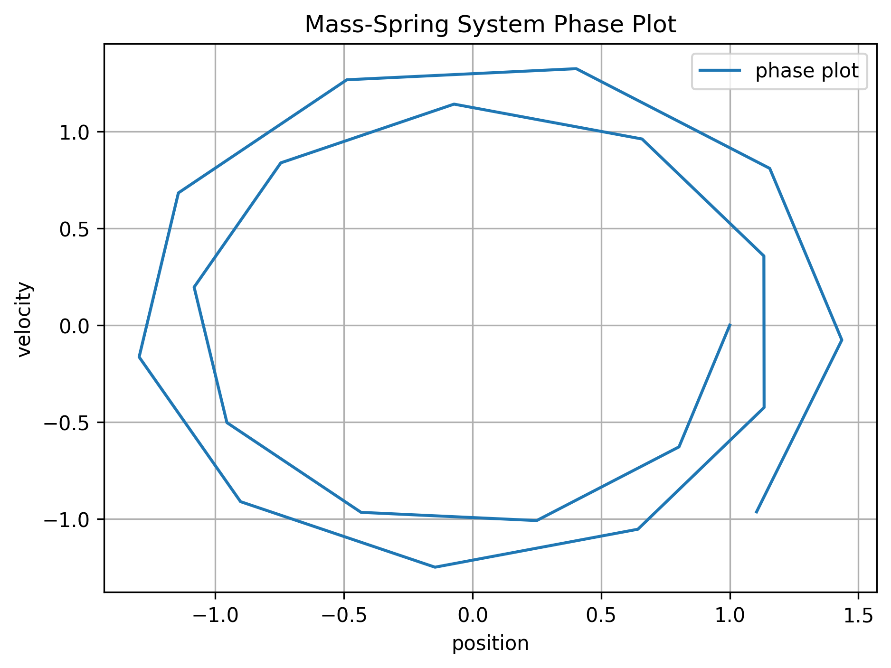
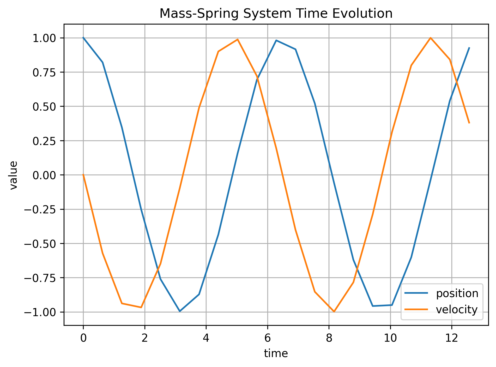
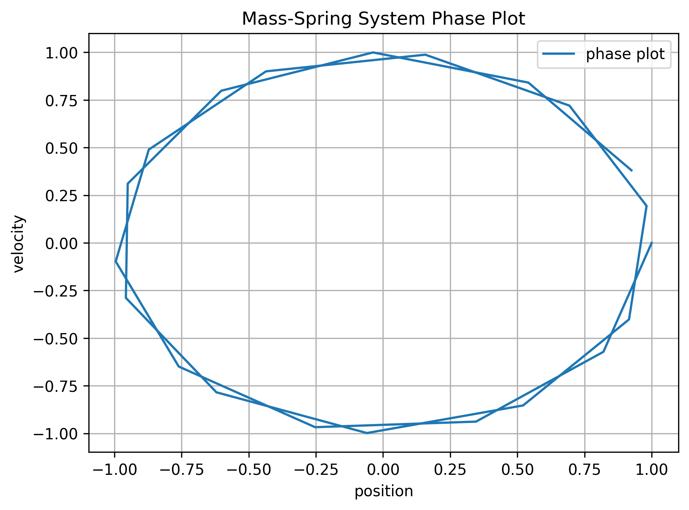
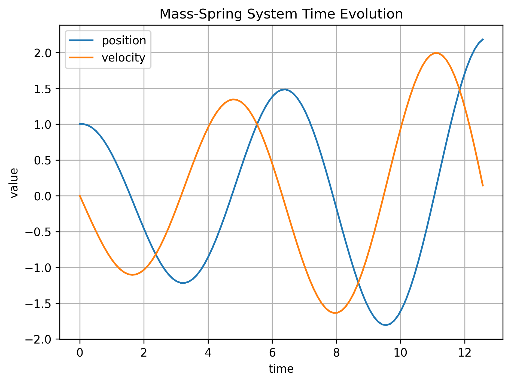
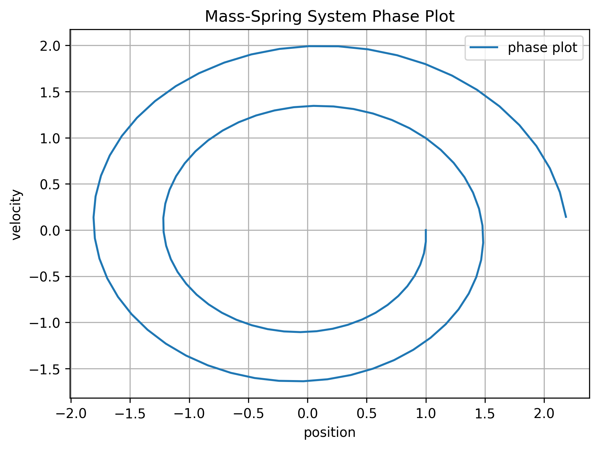
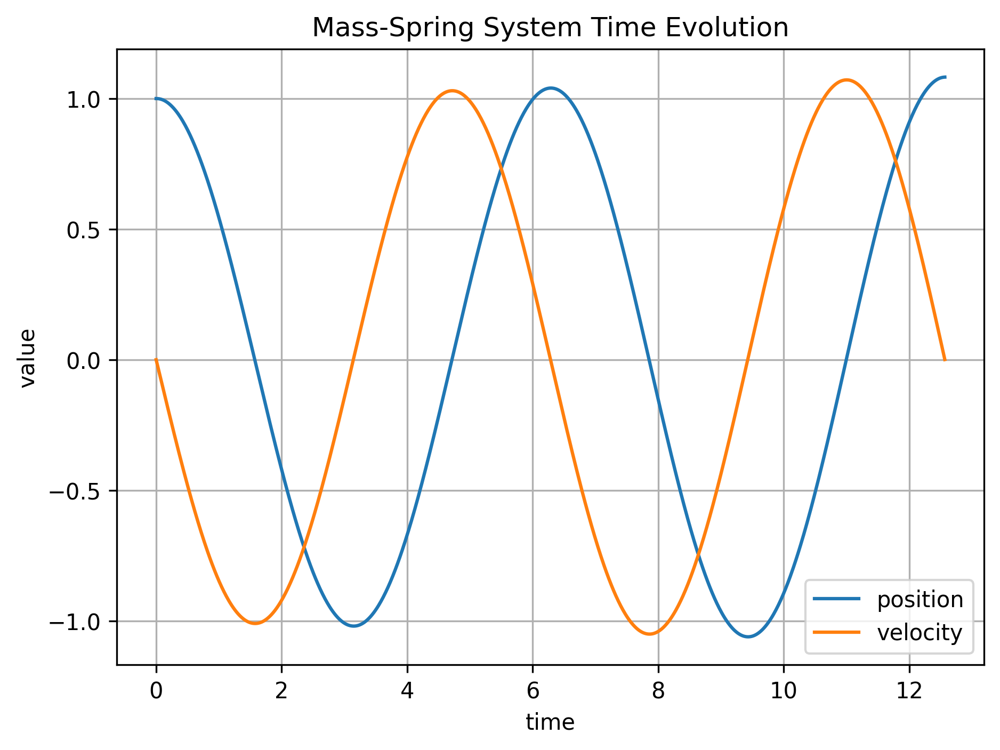

This report will discuss several topics while dealing with the analysis of specific problems that can be modelled using ODEs and solving them numerically with different methods.
Such methods are usually obtained by integrating the ODE and using numerical integration on the given function $f(t,y(t))$.

In the first example, we are given the mass-spring relation, which is given by the following equation:
$m\, y''(t) = -k\, y(t)$
, where $m$ is the mass and k the spring constant. This is an ODE of second order, so first we need to rewrite it  as a problem of first order:

$$
\begin{aligned}
y_0' &= y_1, \\
y_1' &= -\frac{k}{m} y_0 .
\end{aligned}
$$

Now we have a 2-dimensional system that can be written as $y'(t) = f(t,y(t))$ or, in that specific case, it is an autonomous system, so $f = f(y(t))$ only.
Before looking into the numerical schemes, we should analyse what solution we should expect from this problem. If we look at the system, it becomes clear that it is a Hamiltonian system, and therefore, we expect a solution that is conservative with respect to time. Also, if we study the system as a matrix system, we get imaginary eigenvalues with real part = 0. This indicates that the solution of the system must be closed circles in a phase plot.

In the following, we will investigate 4 different methods:
Explicit Euler, Explicit Midpoint Rule (Runge Kutta 2), Implicit Euler, and Crank-Nicolson Method.
Each of them was presented in the lecture.
For the implicit methods, we need to use Newton's method in order to solve for the next time step, since it involves solving an implicit equation.
This method has also been presented in class and is basically calculating the 0 of a given function by using Taylor expansion.
For the explicit Euler, we expect trajectories spiraling outwards, since it is not a symplectic integrator and the energy increases, s.t $E_{n+1} \ge E_n$.
For smaller time steps, this effect will be expected to be less strong.

For the implicit Euler, we expect the opposite effect, trajectories spiraling inwards. This is due to the fact that it is also not a symplectic integrator and it adds artificial damping to the system s.t $E_{n+1} \le E_n$.

For the explicit midpoint scheme and the Crank-Nicolson scheme, both of them are symplectic integrators, so we expect almost perfectly closed circles even for smaller time steps. The simulation goes from $t_0=0$ until $t_{end}=4 \pi$

Explicit Euler 20 time steps

  
  

Implicit Euler 20 time steps

  
  

Improved Euler 20 time steps

  
  

Crank-Nicolson 20 time steps

  
  

Explicit Euler 100 time steps

  
  

Implicit Euler 100 time steps

  
  

Improved Euler 100 time steps

  
  

Crank-Nicolson 100 time steps

  
  

Explicit Euler 1000 time steps

  
  

Implicit Euler 1000 time steps

  
  

The results confirm the expectations. For large time steps, the implicit and explicit Euler are either exploding (Explicit) or totally decaying (Implicit). For the improved Euler, we see slight increase of the energy for larger time steps but as soon as the time steps decrease enough, the solution becomes quite accurate and we observe a closed circle.
For the Crank-Nicholson method, we observe already for very large time steps, that the energy stays conserved, no increasing of amplitude or spiraling outwards in the phase plot. This is expected since it is exactly energy preserving for linear Hamiltonians.
For the Explicit and Implicit Euler, we see even for very small time steps, that the drift away from the equilibrium stays visible.

